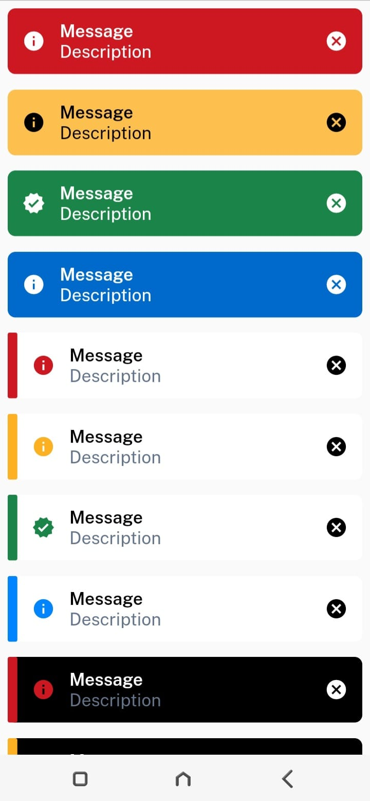

<h1 align=center> Spectrum UI (Under Development) </h1>

<h3 align=center> Amazing UI Components for you to choose from. 📜 </h3>

     
     
     
     
      
     
     
     
     
     
Spectrum UI is a user-friendly Flutter UI library that offers a variety of beautifully designed widgets and components that are easy to use and can be integrated into your Flutter projects seamlessly. With Spectrum UI, you can quickly create stunning mobile app interfaces without spending a lot of time and effort on design and development. The library includes a range of pre-built UI elements such as buttons, text fields, cards, and more, all with a consistent look and feel that will make your app look polished and professional. Whether you're a beginner or an experienced Flutter developer, Spectrum UI makes it easy to create beautiful apps with minimal effort.

## Tech Stacks used 💻

## UI Components include but are not limited to 📖
1. App Bar
2. Bottom Navigation Bar
3. Alerts
4. Calendars UI
5. Buttons 
6. Labels
7. Text Fields
8. Search Fields
9. Slider
10. Notification 
11. Pop up
12. Progress bar 

... and many [more](https://docs.flutter.dev/development/ui/widgets/material).

## Screenshots of some of the UI components :iphone:
<table>
<tr>
     <td>Banner</td>
     <td>Text Field</td>
  </tr>
  <tr>
    <td></td>
    <td></td>
    <td><a href="ScreensShots.md" width=400>see more</a></td>
  </tr>
  </table>

 

 ## 👩🏽‍💻 Contribution

- Contributions make the open source community such an amazing place to learn, inspire, and create.
- Any contributions you make are greatly appreciated.
- Check out our [contribution guidelines](https://github.com/Clueless-Community/flutter-ui-components/blob/master/CONTRIBUTION.md) for more information.

 

<h2 align='center'> Project maintainers </h2>
<table align='center'>
<tr>
 <td align="center">
        <a href="https://github.com/Debajyoti14">
            
             
            <b>Debajyoti Saha</b>
        </a>
    </td>
    <td align="center">
        <a href="https://github.com/roshaen">
            
             
            <b>Roshan Kumar</b>
        </a>
    </td>
      <td align="center">
        <a href="https://github.com/Bhavikk01">
            
             
            <b>Bhavik Kothari</b>
        </a>
    </td>
      </td>
      <td align="center">
        <a href="https://github.com/ashdude1401">
            
             
            <b>Ashutosh Jha</b>
        </a>
    </td>
  </tr>
</table>

## Our Amazing Contributors of this Project 👨‍👨‍👦‍👦❤️
Thanks to all the contributors who worked for this project to stay alive! 😊😎

 

--- 

    <h3><b>Take a moment to star ⭐ the project if you like it</b></h3>
    <h3>Do checkout the other repos 💫</h3> 

