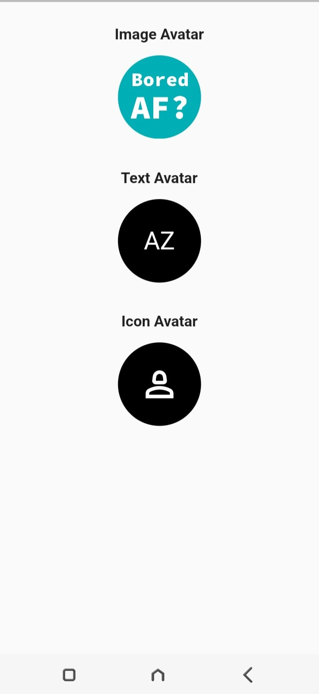
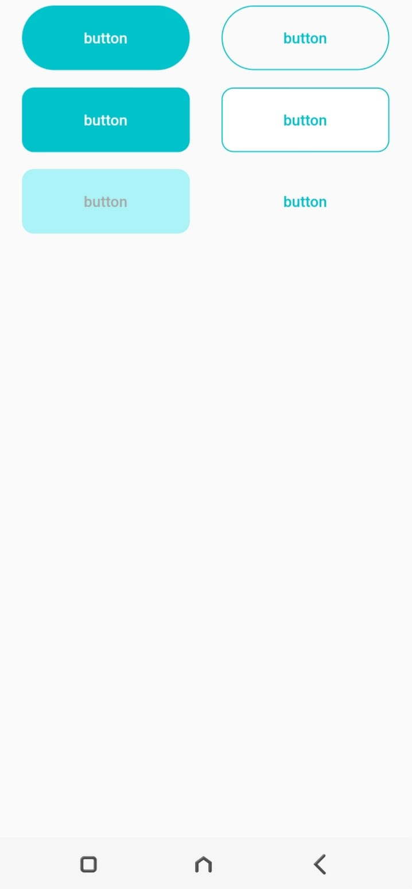

<h1 align=center> Flutter UI Components (Screen Shots) </h1>
<h3 align=center> Amazing UI Components for you to choose from. 📜 </h3>
 
<table>
<tr>
  <td>Splash Screen</td>
  <td>Avatar</td>
  <td>Buttons</td>
  </tr>
  <tr>
    <td></td>
    <td></td>
    <td></td> 
  </tr>
  </table>
